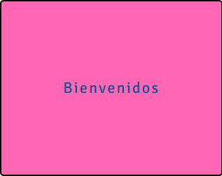

# Box Random

## Objetivo

El trabajo realizado en esta ocasión tiene como objetivo que teniendo un contenedor y su texto estos cambien de estilos; el contenedor cambiará de color y el texto cambiará en su tipo de fuente y tamaño cada vez que la página sea recargada, este trabajo está implementado con JSX.

# Anexos

